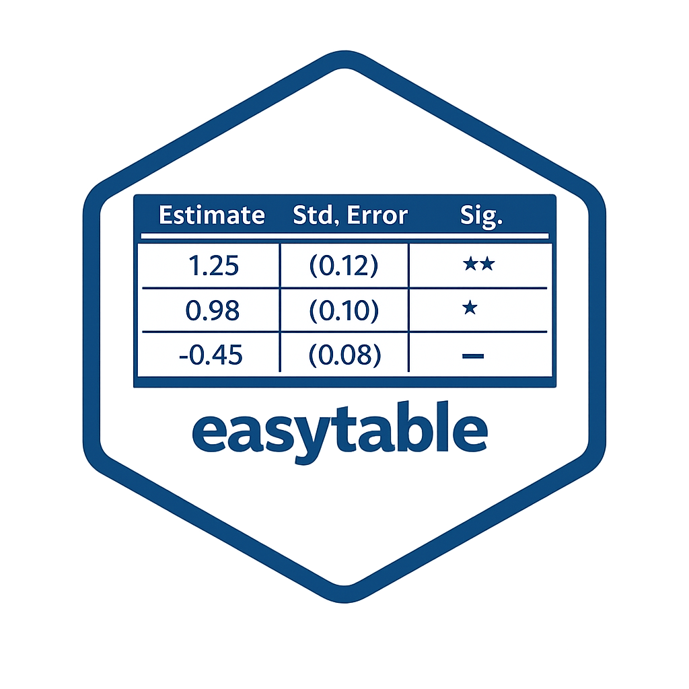

# easytable 

Create regression tables that are easy to use and easy to read.

`easytable` is a workhorse table package for `lm()` and `glm()` models with predictable defaults across Word/HTML and LaTeX/PDF outputs.

[](LICENSE)
[](https://alfredo-hs.github.io/easytable/)
[](https://doi.org/10.5281/zenodo.18673550)
[](https://alfredo-hs.r-universe.dev/easytable)
[](https://github.com/alfredo-hs/easytable/actions/workflows/R-CMD-check.yaml)

## Why easytable

- One main function: `easytable()`
- Code that is easy to use and tables that are easy to read
- Coherent output style across formats
- Optional export to `.docx` and `.csv`
- Control-variable indicators (like Stata)

## Install

To install `easytable` please run the command below:

```r
install.packages("easytable")
```

## Quick Start (Penguins)

```r
library(easytable)
library(palmerpenguins)

m1 <- lm(body_mass_g ~ flipper_length_mm, data = penguins)
m2 <- lm(body_mass_g ~ flipper_length_mm + species, data = penguins)
m3 <- lm(body_mass_g ~ flipper_length_mm + species + island, data = penguins)

# Default output is Word/flextable (also prints in HTML contexts)
easytable(m1, m2, m3)
```

## Core Usage Patterns

### 1) Basic table

```r
easytable(m1, m2, m3)
```

### 2) Custom model names

```r
easytable(
  m1, m2, m3,
  model.names = c("Baseline", "With Species", "Full Model")
)
```

### 3) Control indicators

```r
easytable(
  m1, m2, m3,
  control.var = c("species", "island")
)
```

### 4) Highlight significant coefficients

```r
easytable(
  m1, m2, m3,
  highlight = TRUE
)
```

### 5) LaTeX output

```r
easytable(
  m1, m2, m3,
  output = "latex"
)
```

### 6) Export files

```r
easytable(
  m1, m2, m3,
  export.word = "mytable.docx",
  export.csv = "mytable.csv"
)
```

## Advanced Options

### Robust standard errors

```r
easytable(m1, m2, robust.se = TRUE)
```

### Marginal effects

```r
easytable(m1, m2, margins = TRUE)
```

### Robust SE + marginal effects

```r
easytable(m1, m2, robust.se = TRUE, margins = TRUE)
```

## Supported Model Classes

The `easytable` supports the following models:

- `lm()`
- `glm()`

## Design Invariants

`easytable` enforces these defaults:

1. Coefficient and SE share one cell with a real line break.
2. Zebra striping applies only to coefficient rows.
3. No per-coefficient horizontal rules.
4. Exactly one divider between coefficient rows and model-stat rows.
5. Control indicators belong to the model-stat block.

See `DESIGN_PHILOSOPHY.md` for the full contributor policy.

## Documentation

- Package site: <https://alfredo-hs.github.io/easytable/>
- Function help: `?easytable`
- Tutorial article: `vignette("penguins-tutorial", package = "easytable")`
- Developer roadmap: `vignette("developer-roadmap", package = "easytable")`
- Agent handoff notes: `AI_NOTES.md`
- Testing protocol: `tests/README.md`
- pkgdown source is defined in `_pkgdown.yml`, `pkgdown/index.md`, and `vignettes/`.

## Citation

```text
Hernandez Sanchez, A. (2026). easytable: Create Multi-Format Regression Tables. Version 2.1.1. https://doi.org/10.5281/zenodo.18673550
```

```text
@misc{easytable2026,
	title = {{e}asytable},
	subtitle = {Create Multi-Format Regression Tables},
	author = {Hernandez Sanchez, Alfredo},
	note = {Version 2.1.1},
	year = {2026},
	month = {02},
	date = {2026-02-17},
	publisher = {Zenodo},
	doi = {10.5281/ZENODO.18673550},
	url = {https://github.com/alfredo-hs/easytable}
}
```

## Acknowledgements

This package was created as an education technology to facilitate statistics teaching. Many thanks to the students at Vilnius University and the University of Bucaramanga for their feedback on usability and design. The development of this package was assisted by AI coding tools such as Gemini `3.1 Pro`, Claude `4.5 Sonnet`, and ChatGPT `5.3 Codex` for code debugging, documentation updates, and package restructuring. 
